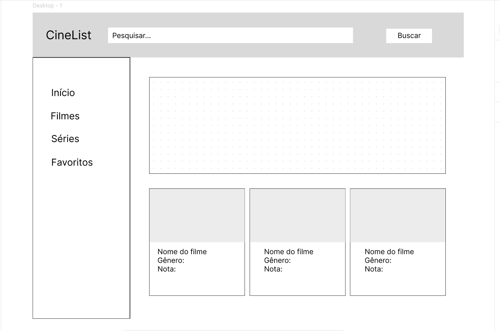
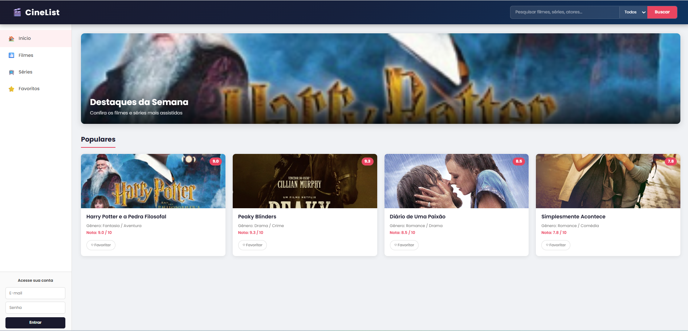
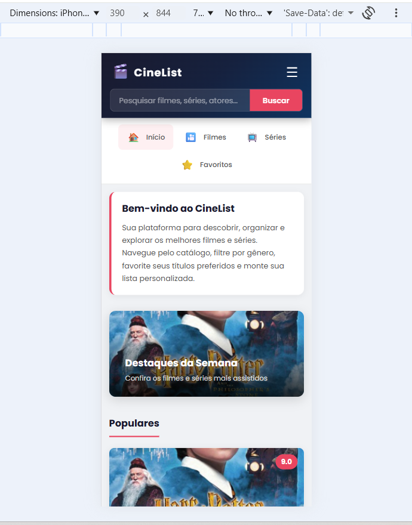

[](https://classroom.github.com/open-in-codespaces?assignment_repo_id=23203732)

# Trabalho Prático 2 - Aplicação Completa (Login, Favoritos, Pesquisa e CRUD)

O **CineList** evoluiu para uma aplicação completa sobre **JSON Server**, que provê
tanto o back end (API REST) quanto o front end (arquivos estáticos da pasta `public`).

## Como executar

```bash
npm install   # instala o json-server (uma única vez)
npm start     # sobe a API + o site em http://localhost:3000
```

Depois abra **http://localhost:3000** no navegador.


A API REST fica disponível em:
`/categorias`, `/titulos`, `/usuarios`, `/favoritos`, `/aluno`.


## Usuários de teste

| Login   | Senha | Perfil          |
|---------|-------|-----------------|
| `admin` | `123` | Administrador (vê o menu **Cadastro** / CRUD) |
| `user`  | `123` | Comum (favoritos) |

## Funcionalidades entregues

- **Login e cadastro de usuário** (`login.html`) com sessão mantida em `sessionStorage`.
- **Menu dinâmico**: mostra *Login* (deslogado), ou *Favoritos* + *Logout* (logado),
  e *Cadastro* apenas para administradores.
- **Pesquisa** de títulos por nome ou descrição na home (Seção 2).
- **Favoritos**: coração vazado/preenchido em cada card e na tela de detalhes,
  persistidos em `/favoritos` do JSON Server.
- **Página de favoritos** (`favoritos.html`) do usuário logado.
- **CRUD de itens** (`cadastro_itens.html`) — inserir, alterar, excluir e listar (somente admin).
- **Carrossel** de destaques (Bootstrap) e **gráfico** (Chart.js) — Seções 1 e 3.
- **Detalhes do item** (`detalhes.html`) com dados da entidade secundária (fotos).

---

# Trabalho Prático - Semana 04 e 05

Dessa vez, vamos dar sequência ao projeto iniciado na semana passada. Se você ainda não fez o projeto da semana anterior, fique atento, se programe e procure colocar as atividades em dia. Volte lá, leia tudo e faça sua parte pois essa atividade depende da atividade anterior..

Nessa atividade,vamos evoluir o projeto para que a home-page funcione bem tanto no celular quanto no desktop, entendendo também como é o processo gradativo e colaborativo de desenvolvimento de um software, registrando cada etapa no histórico de commits do repositório do git/GitHub.

## Informações Gerais

- Nome: Sophia Emanuelle de Morais dos Santos
- Matrícula: 925579
- Proposta de projeto escolhida: CineList - Catálogo de Filmes e Séries
- Breve descrição sobre o projeto: O CineList é uma plataforma web para organizar e explorar filmes e séries. A página permite pesquisar títulos por nome ou gênero, filtrar entre filmes e séries, favoritar títulos e fazer login. O layout conta com um menu lateral de navegação, um banner de destaques e cards com informações de cada título como gênero e nota.

## Wireframe do Projeto



## Print da Home-Page

### Versão Desktop (CSS Puro)



### Versão Mobile (CSS Puro)

> **Nota:** Tire um print da versão mobile usando o DevTools do navegador (F12 > ícone de dispositivo móvel) e salve como `public/imagens/homepage-mobile.png`, depois atualize este README.


